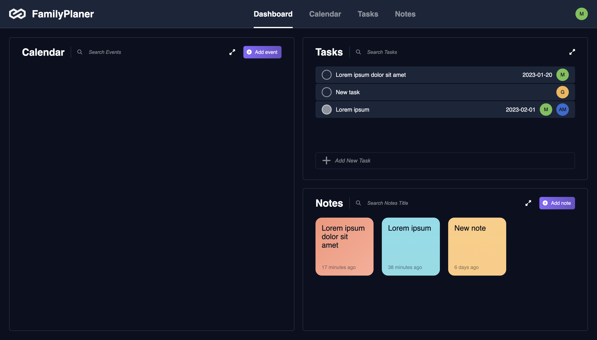
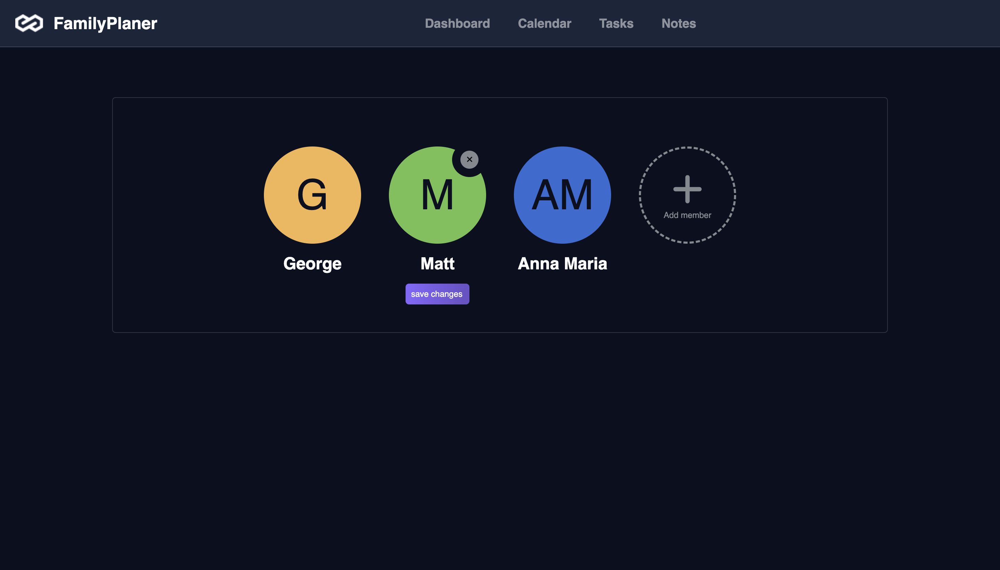
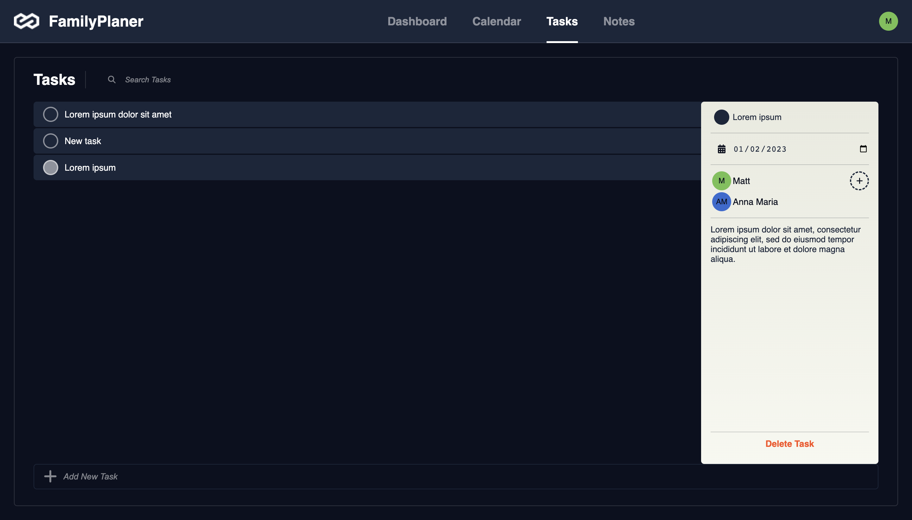
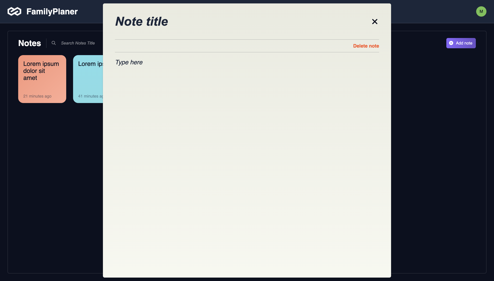

# Family Planer - take control of your family duties!
Web app created with React.js, JavaScript, and Firebase backend.

## Table of contents
1. [General Info](./README.md#general-info)
2. [Technologies & Libraries](./README.md#technologies--libraries)
3. [Features](./README.md#features)
4. [Project status](./README.md#project-status)

## General Info
The Family Planer is a web application helping families organize their duties and share information among family members. 
The app was created and developed to practice and improve frontend skills under the supervision of a mentor from the DareIT program.
App design is based on the Figma sketch available [here](https://www.figma.com/proto/Dl5KQE4pV3xIKqJXTAGeiZ/Family-Planer?node-id=1%3A2&scaling=min-zoom&page-id=0%3A1&starting-point-node-id=1%3A2).

## Technologies & Libraries
- React.js (18.2.0)
- JavaScript (ECMAScript 2021)
- CSS3 / SCSS
- Firebase (9.13.0)
- Styled-Components (5.3.6)
- React Router DOM (6.4.3)
- Fontawesome (6.2.0)
- React-time-ago (7.2.1)
- NPM (8.15.0)
- Webpack (5.74.0)
- Prettier(2.8.1)

## Features:

### Authorization
Create your family account with email and password authorization. Email confirmation is required. 
Learned skills: 
- authorization in Firestore
- using context and provider

### Create members of your family
It is working exactly as a Netflix account. On this view, you can create a new family member, and edit or delete ones. For each member, you can pick a logo color and type name. Logo letters appear automatically.
Learned skills: 
- using local storage
- working with Firestore backend
- using regex

### Dashboard
Family Planer consists of three modules: Calendar, Tasks Section, and Notes Section. Each of them may be used in full screen. You can switch the view in the header navigation. There is also your profile logo with a hidden menu to choose another family member or log out family.
Learned skills: 
- creating navigation and paths with React Router DOM

### Tasks Section
The tasks section is an extended to-do list with the possibility to assign a family member responsible for that task, add a deadline, or put in more information. 
Click on a single task opens the editor, click outside the editor closes and saves changes. Task checking is independent of the editor.
Learned skills: 
- using advanced refs
- creating custom hooks

### Notes Section
The notes section allows users to create, edit, and save notes. Click on a note opens a modal - note editor.
Learned skills:
- using modal

## Project status
Family Planer is still being developed. The Calendar section is under construction. Styles and responsiveness are going to be improved. 
